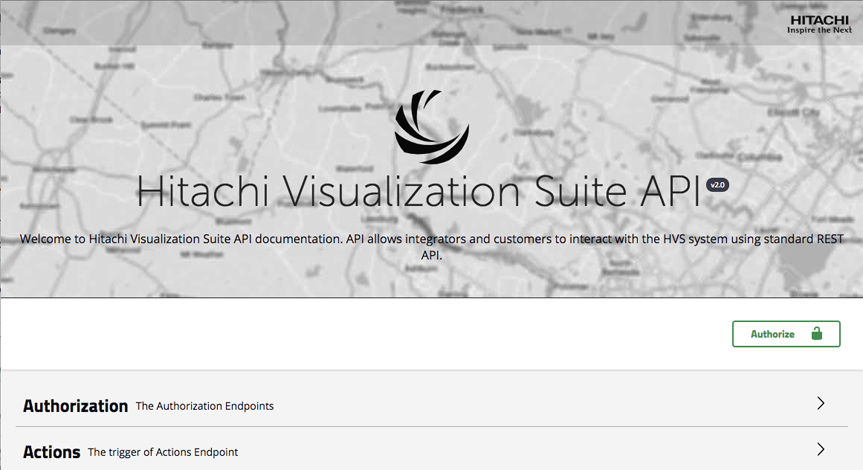
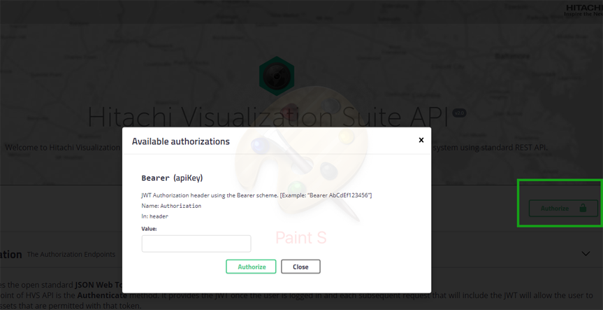

Hitachi Visualization Suite API allows integrators and users to
interact with the Visualization Suite system using a standard REST
API. You can find the available APIs in the built-in Swagger API user
interface (UI) or using your preferred REST client application.

# API overview

Hitachi Visualization Suite API allows integrators and users to
interact with the Visualization Suite system using a standard REST
API. You can find the available APIs in the built-in Swagger API user
interface (UI) or using your preferred REST client application.


Use the following link to access the Visualization Suite API
documentation in Swagger.

[<u>https://\<HVS API instance\>/swagger/index.html</u>](https://\<HVS API instance\>/swagger/index.html)

- Visualization Suite Production Cloud
  [<u>https://api.hitachismartcamera.com/swagger/</u>](https://api.hitachismartcamera.com/swagger/index.html)
  [<u>index.html</u>](https://api.hitachismartcamera.com/swagger/index.html)

- Visualization Suite Staging Cloud
  [<u>https://api.hitachismartcamera.com/swagger/index.html</u>](https://api.hitachismartcamera.com/swagger/index.html)

For more information about the Swagger OpenAPI 2.0, see
[<u>https://swagger.io/docs/</u>](https://swagger.io/docs/specification/about/)
[<u>specification/about/</u>](https://swagger.io/docs/specification/about/)

For more information, see the Visualization Suite Web API Installation
section in the Installation Guide.



# Authentication and authorization

Visualization Suite API uses the open standard JSON Web Token (JWT) to
provide a compact and self-contained way for transmitting information
and uses Bearer authentication, also called token authentication is an
HTTP authentication scheme that involves security tokens called bearer
tokens.
>**Note:** The Visualization Suite v6.4 REST API no longer accepts the user account. It only accepts the service account.

# Authorize request

Before making any requests, click Authorize to authorize your session
and complete the information in the **Authorization** screen:



To receive the Bearer schema, use authenticate method under
**Authorization**.


# Make a request

### Procedure

1.  Expand the endpoint.

2.  Click **Try it out**.

Upon click, the example value in the **Request Body** field becomes
editable.

3.  Make necessary changes.

4.  Click **Execute**.

### Result

Swagger UI submits the request and shows the curl that was submitted.
The Responses section shows the response.

If you select JSON rather than XML in the Response content type list,
you can specify that JSON is returned rather than XML.

# Modify entities

The PATCH verb is a type of HTTP request method for applying partial
changes to an existing resource.

To standardize the way the server expects these changes, JSON PATCH
standard has been created on top of PATCH verb.

You can enter a body parameter containing a list of operations
describing the changes that must be applied in the specified order to
the specified resource.

The following are the supported operations:

- add

- remove

- replace

- move

- copy

## API

PATCH will be available at the same route of PUT verb.

## Update name, description, and timestamp

The "add" and "replace" operations are interchangeable in this
scenario because they will update the field to the new value.


If we start from the simplest entity that we can create:

```
{
	"name": "Test Entity \#1"
}
```

and then we apply this patch operation:

```
[
{ "op": "add", "path": "name", "value": "New name" }
]
```

The entity will look like:

```
{

"name": "New Name"

}
```

You can send many operations at a time and execute them one after the
other.

In the following sample, the patch request will initialize or update
name, description and timestamp fields as specified in the array.

```
[

{ "op": "add", "path": "/name", "value": "New name" },

{ "op": "add", "path": "/description", "value": "New description" },

{ "op": "add", "path": "/timestamp", "value": "2018-04-18T00:00" }

]
```

## Update tags

Patch allow also to manage even arrays like tags.

> **Note:** Before adding an item into an array it needs to be initialized first.

In the following sample, you are first initializing the tags array and
then adding on tag at a time.

```
[

{ "op": "add", "path": "/tags", "value": \[\] },

{ "op": "add", "path": "/tags/-", "value": "tag1" },

{ "op": "add", "path": "/tags/-", "value": "tag2" }

]
```

You can directly define the array items like in the following sample:

```
[

{ "op": "add", "path": "/tags", "value": \[tag1", tag2", tag3"\] }

] 
```

## Update coordinates

Initialize location of an entity can be done using the following

```
[

		{

		"op": "add",

		"path": "location", 

		"value":{

			"type":"Point",

			"coordinates": [9.2343, 40.23434]

		}

	}

]
```

While update is possible with just

\[

{

"op": "replace",

"path": "location/coordinates", "value":\[8.23423, 31.23423\]

}

\]

## Update attributes

Attributes can be initialized using the following command:

\[

You can replace the value of one of the existing attributes by using
the following command:

{

"op": "add",

"path": "attributes", "value": {

"key_number_1":{ "label": "Key \#1",
>
"value":"value1"
>
},
>
"key_number_2":{ "label": "Key \#2", "value":true
>
},
>
"key_number_3":{ "label": "Key \#3", "value":{
>
"complex_object": true
>
}
>
}

}

}

\]

\[

{

"op": "replace",

As described in this issue page,adding a single attribute from scratch
will not work untill Asp.Net Core 2.1 is released.

"path": "attributes/key_number_1/value",

"value": "new value"

}

\]

[<u>https://github.com/aspnet/JsonPatch/issues/96</u>](https://github.com/aspnet/JsonPatch/issues/96)
