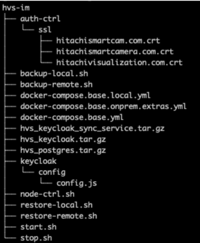

# Install and configure HVS on Redhat

You can install and configure HVS on the Red Hat Enterprise Linux OS. Follow the instructions to create a High Availability (HA) infrastructure with multiple application servers. Configure unique HTTPS ports for managing all the HTTPS protocol from a single HAProxy server in addition to the standard port 443.

> Note: Based on your organization, you must open the firewall for the unique HTTPS ports.

With this kind of installation, users can access HVS from a web browser of a client PC
through HAProxy but cannot access any HVS system directly.

## Prerequisites

Before proceeding further, make sure to complete the following prerequisites:

1. Configure the Red Hat server.
2. Download the installation packages, such as IDM, API, web UI, workflow service manager, and so on from TISC.
3. Upload the installation package to a server using your preferred method. For example, Secure Copy Protocol (SCP).

## Install and configure HVS identity management

Complete the following tasks to install and configure the HVS IDM:<br>

### Extract the installation package

Extract the HVS IDM installation package as follows:<br>

**Procedure:**

<ol><li>SSH to the linux server where you have downloaded the installation package:<br>

```
ssh USERNAME@IP_ADDRESS
```

</li><li>Create a new directory, <code>hvs-im</code> and extract the contents of the installation package to that directory:

```
mkdir ~/hvs-im
tar -zxvf package_name -C ~/hvs-im
```

The following image depicts the sample structure after extraction:<br></li></ol>
