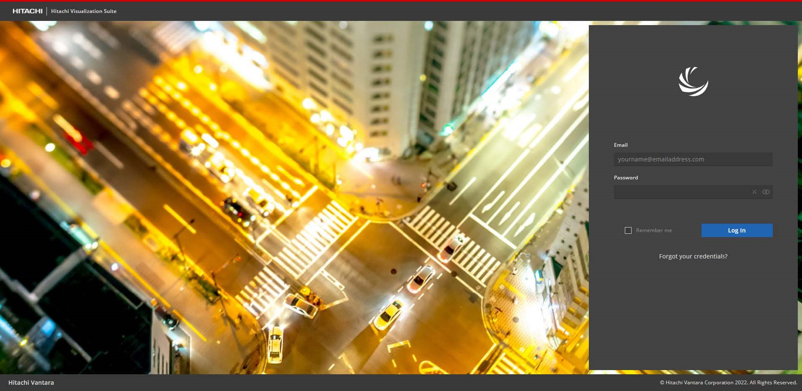
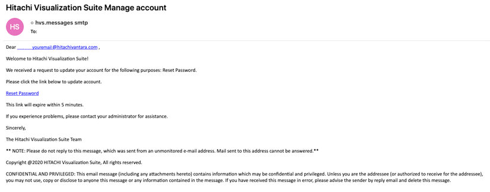

# Login

The Visualization Suite administrator creates your user account and provides access to log in
to the application.
You receive an email from your administrator with a link to update your account. Click the link
and reset the password. See [Password reset](#password-reset) for more details.
After resetting the password, you can access the Visualization Suite application.

## Password reset

You must reset the user account password in the following scenarios:

- User account is created.
- User account expired.
- User account is locked.
- Forgot user account credentials.

Perform the following steps to reset the password:

### Procedure

1. Click **Forgot your credentials?** in the Hitachi Visualization Suite login window.  

2. Enter the email address associated with your account username.

3. Click **Recover**.  An email with "Hitachi Visualization Suite Manage account" as the subject is sent to your
   specified email address.

4.  Check your inbox for the email. 

   > **Note:** If you do not receive the confirmation message within a few minutes
   > of submission, check your **Junk E-mail** folder to see if the confirmation
   > email was delivered to that folder instead of your inbox. If yes, select the
   > confirmation message and click **Not Junk** to receive future messages
   > directly in your inbox.

   

5. Click **Reset Password** link or copy the link and paste it into a browser. 

   > **Note:** The reset password process automatically expires after a period of
   > time. Default time is 5 minutes.

6. Enter **New Password**, then enter **Confirm Password**. Provide a password that meets
      with Visualization Suite password policy.

7. Click **Recover** and access the Visualization Suite application.
