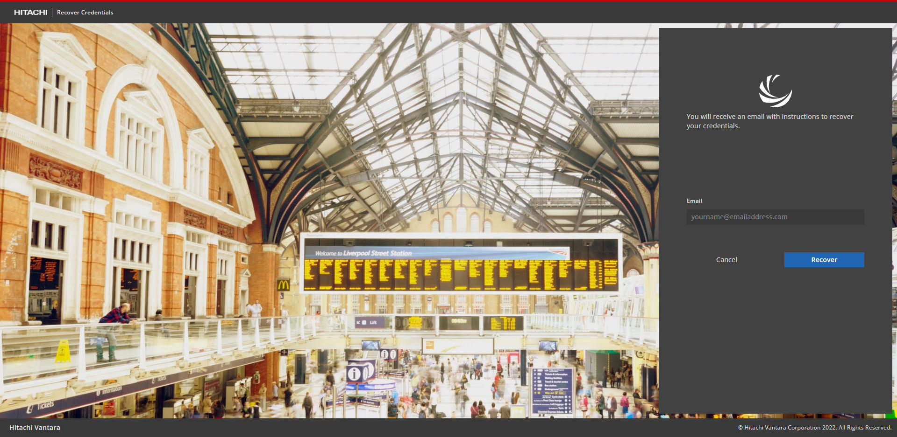

# Get started

The Visualization Suite administrator creates your user account and provides access to log in
to the application.
You receive an email from your administrator with a link to update your account. Click the link
and reset the password. See [Password reset](#password-reset) for more details.
After resetting the password, you can access the Visualization Suite application.

## Password reset

You must reset the user account password in the following scenarios:
- User account is created.
- User account expired.
- User account is locked.
- Forgot user account credentials.
Perform the following steps to reset the password:

### Procedure

1. Click **Forgot your credentials?** in the Hitachi Visualization Suite login window. 

 The **Recover Credentials** page appears.

2. Enter the email address associated with your account username.
3. Click **Recover**. 
