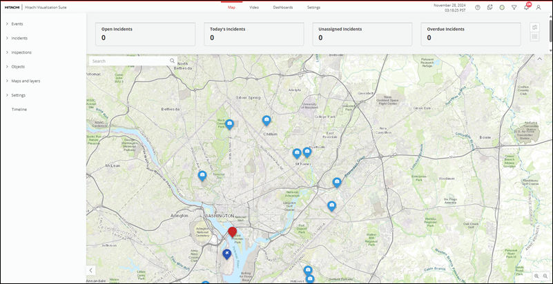

You can visualize integrated data from multiple sources using the map view. Map enables you
to view every entity related to events, inspections, incidents, and objects in real-time.
By default, HVS is configured to use Google Maps. However, it supports other custom map
configurations as well. Contact your administrator for more information.
Map displays the available entities in the left pane. Each entity is categorized based on the
entity type. For example, Objects lists the stationary and camera related entities. When you
click the camera entity, HVS displays the map markers related to all cameras on the map. To
remove the map markers from the map view, click camera again.
You can use the left pane to filter the map markers on the map view. To get quick information
about an entity in the InfoWindow, click the map marker.

## Map view

The map view includes several key components to help you visualize every entity in HVS.    

| Items     | Description                                                  |
| --------- | ------------------------------------------------------------ |
| Left pane | Contains the entity types and menu items. A few entities in the entity type show heat map and view detail icons. Expand the entity type and select the entity you want to display on the map: <ul> <li> Events: Displays events that can occur suddenly, such as gunshots or 911 calls under different event types.</li><li>Incidents: Displays incidents that impact normalcy of business operations.</li><li>Inspections: Displays inspections created for monitoring infrastructure.</li><li>Objects: Displays the stationary items, such as buildings and cameras.</li><li>Heat map icon: Shows the intensity of the entity.</li><li>View Details icon: Takes you to the entity detail page.</li><li> Maps and Layers: Displays the available layers and map options such as ESRI, Google Maps configured in the system.</li><li>Settings: Displays the settings that are available for configuration based on your access permissions. For example, domains, memberships, audit, and others.</li><li>Timeline: Displays historical data for the events.</li> |
|           |                                                              |
|           |                                                              |
|           |                                                              |
|           |                                                              |
|           |                                                              |

